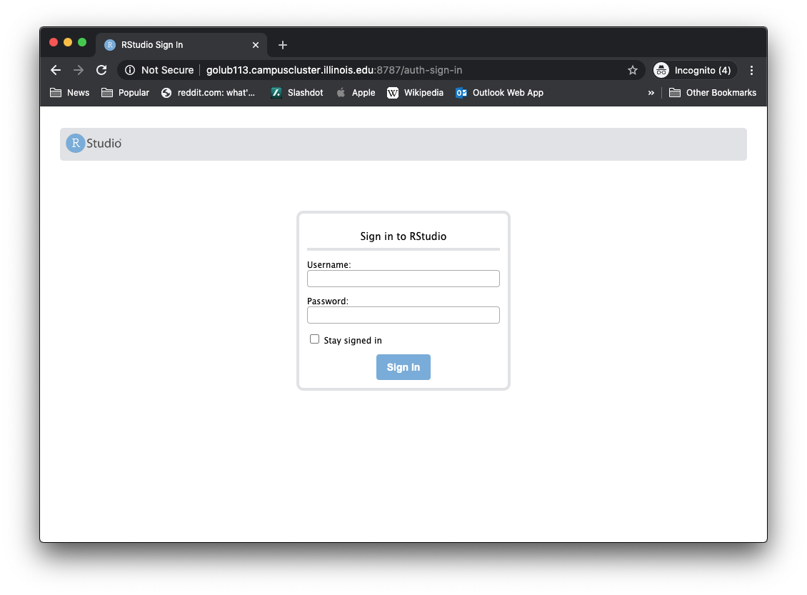

# RStudio Server via Singularity

Contained within are the modulefiles and [scripts](script/) for 
setting up an interactive job on the cluster that launches RStudio Server.



On launch, users will see: 

```
RStudio Server instance is now available at:

http://${HOSTNAME}.campuscluster.illinois.edu:${PORT}

>> Warning: Must be on Campus VPN to connect! <<

For SSH access, please type in terminal:

ssh -N -L 8787:${HOSTNAME}:${PORT} ${USER}@cc-login.campuscluster.illinois.edu

Then, on your local computer open in a web browser: http://localhost:8787

To login use:

Username: ${USER}
Password: ${PASSWORD}
```
